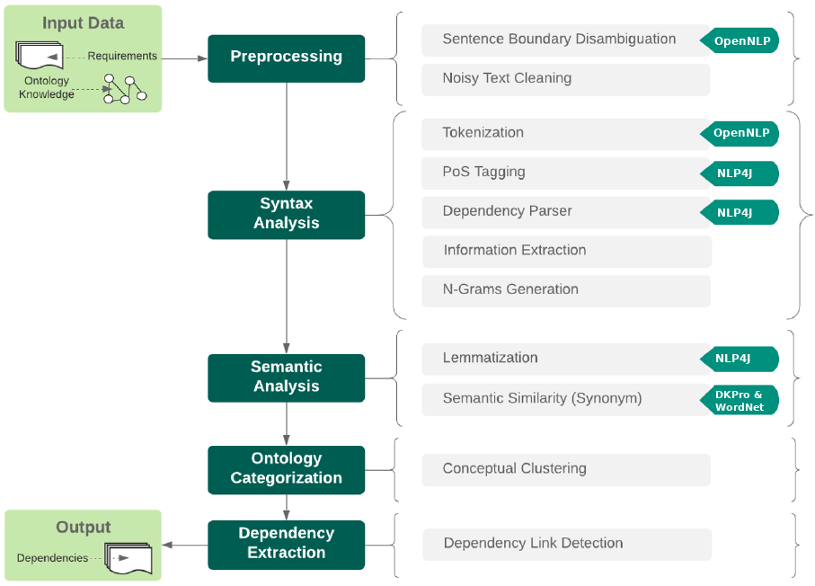

# Dependency Detection

_This service was created as a result of the OpenReq project funded by the European Union Horizon 2020 Research and Innovation programme under grant agreement No 732463._

## Introduction

The **dependency detection** tool is a Requirement Engineering (RE) tool for extracting dependencies between requirements. It is based on an ontology which defines dependency relations between specific terminologies related with the domain of the requirements. Using this information, it is possible to apply Natural Language Processing (NLP) techniques to extract meaning from this requirements and relations, and Machine Learning techniques in order to apply conceptual clustering, with the major purpose of classifying this requirements into the defined ontology.

## Technical description

Next sections provide a general overview of the technical details of the dependency detection tool.

### Dependency detection functionality

The next figure shows the sequence of steps that OpenReq-DD performs to extract requirement dependencies.



#### I/O Data

#### Dependency Detection process

In the next sections we review step by step the dependency detection process.

##### Preprocessing

In order to reduce deficiencies in the data set, two preprocessing methods are applied to the requirements list.

1. **Sentence Boundary Disambiguation (SBD).** Apply sentence detection to extract isolated sentences from
each requirement, by deciding where is the beginning and the end of each sentence. The Apache toolkit
OpenNLP is used for this purpose.

2. **Noisy Text Cleaning.** After SBD, a total of 14 rules are applied to clean input text of each sentence.
These include: removal of character, numeric and roman numerals list pointers; removal of acronyms that
may appear at the beginning of a requirement; removal of scape sequence characters; addition of white
spaces to prevent PoS tagger faults (e.g. between parenthesis or question marks); between others.

##### Syntax Analysis

Given the preprocessed requirements, and therefore a list of cleaned segmented requirements, a syntax analysis
is applied in order to extract words that can be potential candidates of a match with concepts of the ontology.

1. **Tokenization.** The input sentence is split into single words using the OpenNLP toolkit.

2. **PoS tagging.** Each token of the sentence is marked with a part-of-speech tag using the NLP4J toolkit.

3. **Dependency Parser.** Generates a dependency tree where each node is a token of the input sentence and
edges are the relations between parent words and child words. This is done using the NLP4J toolkit.

4. **Information Extraction.** Once the data is in an optimal form to be analyzed, the keywords to categorize
each requirement into the ontology can be extracted. For this keyword extraction, a set of potential keywords
is assumed given the results of manual requirements analysis performed by stakeholders from the project.
Given these keywords, a set of patterns were extracted according to the position of these topics.

5. **N-Grams Generation.** The matched patterns inside the dependency tree are analyzed in order to generate
n-grams of nodes directly connected within the tree that are composed by a set of keywords encapsulating
a big concept, a general idea superior to the individual meaning of each keyword.

##### Semantic analysis

Semantic analysis is the process that interprets the language meaning (i.e. the topic concept) of the whole text.
The main goal is to obtain the meaning of each keyword of the n-gram, and join them to get a unique meaning
that can be matched with the concepts of the ontology.

1. **Lemmatization.** The morphological analyzer included in the NLP4J framework is used to apply several
rules (based on a large dictionary and several advanced heuristics) to extract the lemmas of each token.
These lemmas allow us to compare different words with the same lexeme.

2. **Semantic similarity.** The DKPro-Similarity framework is used as a word pair similarity detection in
order to improve the lemmatization process, by identifying those tokens with a high similarity score that
are not identified as part of the same lexeme. This step is potentially interesting for synonyms and similar
meanings, which are analyzed using the lexical database WordNet.

##### Ontology categorization

OpenReq-DD uses conceptual clustering to classify requirements into the different concepts of the input ontology
by similar features. For each n-gram obtained in the semantic analysis, the following rules are applied.

- First, it tries to find equal matches between words combinations of the n-gram and the n-grams of the ontology.
- If there is no match, find equal matches between combinations of the extracted lemmas from the n-gram and
the extracted lemmas of the input ontology.
- If there is no match, calculate the semantic relatedness between lemmas from the n-gram and the input
ontology. The requirement is matched if the value is greater than a provided threshold.
- If none of the previous conditions are satisfied, the requirement is discarded as an individual in the ontology.

The result of this step is the ontology filled by requirement individuals.

##### Dependency Extraction.

Finally, each pair of classes that are linked with a dependency relation are analyzed extracting their instances
(i.e. the requirements individuals) to find the dependencies between each requirement.

### Used technologies

* Swagger (&rarr; [https://swagger.io/](https://swagger.io/) )
* Maven (&rarr; [https://maven.apache.org/](https://maven.apache.org/) )
* DKPro Similarity framework (&rarr; [https://dkpro.github.io/dkpro-similarity/](https://dkpro.github.io/dkpro-similarity/) )
* Apache OpenNLP Toolkit (&rarr; [http://opennlp.apache.org](http://opennlp.apache.org) )
* NLP Toolkit for JVM Languages (NLP4J) (&rarr; [https://emorynlp.github.io/nlp4j/](https://emorynlp.github.io/nlp4j/) )

### How to install

First of all it is necessary to download the following external files and dependencies and place them into the src/main/resources directory:

- [ResourceFactory resources file](https://docs.google.com/uc?export=download&id=1hkXniK5pNVDbplT22cQtyHum53IbFvNE)
- [WordNet ESA](https://docs.google.com/uc?export=download&id=1I6oQqIeZva1CwLA96OkHFSZKiBfUgWLe)
- [WordNet LexSemResources](https://docs.google.com/uc?export=download&id=1TeYlsHbcCtxbsVVoBvttdVsvbKFHPbZn)

Seconf of all it is necessary to download the following file and extract its content into gloveModel/ folder (at the root of the service)

- [GloveModel](https://drive.google.com/file/d/1E-jkanZQSjXAuwx3EXyGKAyMQ8QBWobA/view?usp=sharing)

Then is necessary to configure the DKPRO_HOME variable with the resources directory path:

- export DKPRO_HOME=/path/dependency-detection/src/main/resources

Once this resources are in the resources project directory, build the maven project:

```
mvn clean install package
```


### How to use it

You can take a look at the Swagger documentation [here](https://api.openreq.eu/dependency-detection/swagger-ui.html), which includes specific, technical details of the REST API to communicate to the service.

### Notes for developers

### Sources

* K. Pohl, The three dimensions of requirements engineering: A framework and its applications, Information
Systems, 19(3):243–258, 1994.
* O. C. Z. Gotel and C. W. Finkelstein, An analysis of the requirements traceability problem, In Proc. of
IEEE International Conference on Requirements Engineering, pages 94–101, 1994.
* A. P. Nikora and G. Balcom, Automated identification of ltl patterns in natural language requirements, In
20th International Symposium on Software Re-liability Engineering, pages 185–194, 2009.
* OpenReq, Project, Accessed: 2019-01-11. [Online]. Available: https://openreq.eu/.
* Apache OpenNLP Toolkit, Accessed: 2019-01-11. [Online]. Available:http://opennlp.apache.org
* NLP Toolkit for JVM Languages (NLP4J), Part-of-speech Tagging, Accessed: 2019-01-11. [Online]. Avail-
able: https://emorynlp.github.io/nlp4j/.
* DKPro Similarity framework, Accessed: 2019-01-11. [Online]. Available: https://dkpro.github.io/dkpro-
similarity/.
* WordNet - A Lexical Database for English, Accessed:
2019-01-11. [Online]. Available:
https://wordnet.princeton.edu/.

## How to contribute

See OpenReq project contribution [guidelines](https://github.com/OpenReqEU/OpenReq/blob/master/CONTRIBUTING.md)

## License

Free use of this software is granted under the terms of the [EPL version 2 (EPL2.0)](https://www.eclipse.org/legal/epl-2.0/)
