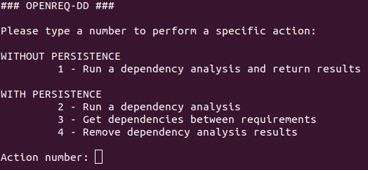
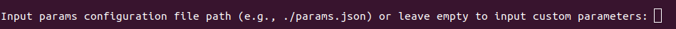
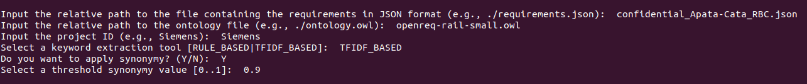

# OpenReq-DD Python client

This project contains a Python-based client for the OpenReq-DD web service. It exposes the main functionalities deployed by the Dependency Detection REST API service.

## How to run it

The python client is configured to run on a locally deployed instance of the OpenReq-DD service. To change this configuration, it is necessary to edit line #7 of the _openreq-dd.py_ Python script file with proper _host_ and _port_ values:

```
URL = "http://<host>:<port>/upc/dependency-detection/"
```

To run the client, go to the root folder of the project and run:

```
python openreq-dd.py
```

## How to use it

The client prompts a user manual with the reference of the different functionalities exposed by the OpenReq-DD tool:



These functionalities are classified into two blocks:

- **WITHOUT PERSISTENCE**. Addressed to run a dependency analysis and store the results in the local client machine (results are not stored in the server)

- **WITH PERSISTENCE**. Addressed to run a dependency analysis and store the results in server-side. Allows additional features like asking for the dependencies between two requirements or removing a dependency analysis result.

### Using stored configuration files

Running a dependency analysis (actions #1 and #2) requires a set of configuration parameters and data files. For this purpose, it is possible to define a set of JSON configuration files to avoid the need of input these parameters manually for each request.

When selecting action #1 or #2, the following prompt is shown:



The user is requested to input a configuration file path for the dependency analysis. This JSON file must have the following structure:

```
{
	"requirementsFile": "./requirements.json",
	"ontologyFile": "./ontology.owl",
	"project": "ProjectID",
	"keywordTool": "TFIDF_BASED",
	"synonymy": "Y",
	"threshold": 0.9
}
```

A description of each field is provided below:

- **requirementsFile**: relative path to the python client where the requirements file in the JSON OpenReq format is stored
- **ontologyFile**: relative path to the python client where the ontology file is stored
- **project**: the project ID of the requirements to be analyzed
- **keywordTool**: the keywordTool used for the analysis (TFIDF_BASED or RULE_BASED)
- **synonymy**: whether to use synonymy (Y) or not (N) during the analysis
- **threshold**: only used when synonymy = 'Y', sets the synonymy threshold value (any value between [0..1])

### Using custom configuration parameters

If no parameters configuration file is input, the client asks the user to input each parameter using the command line prompt:


